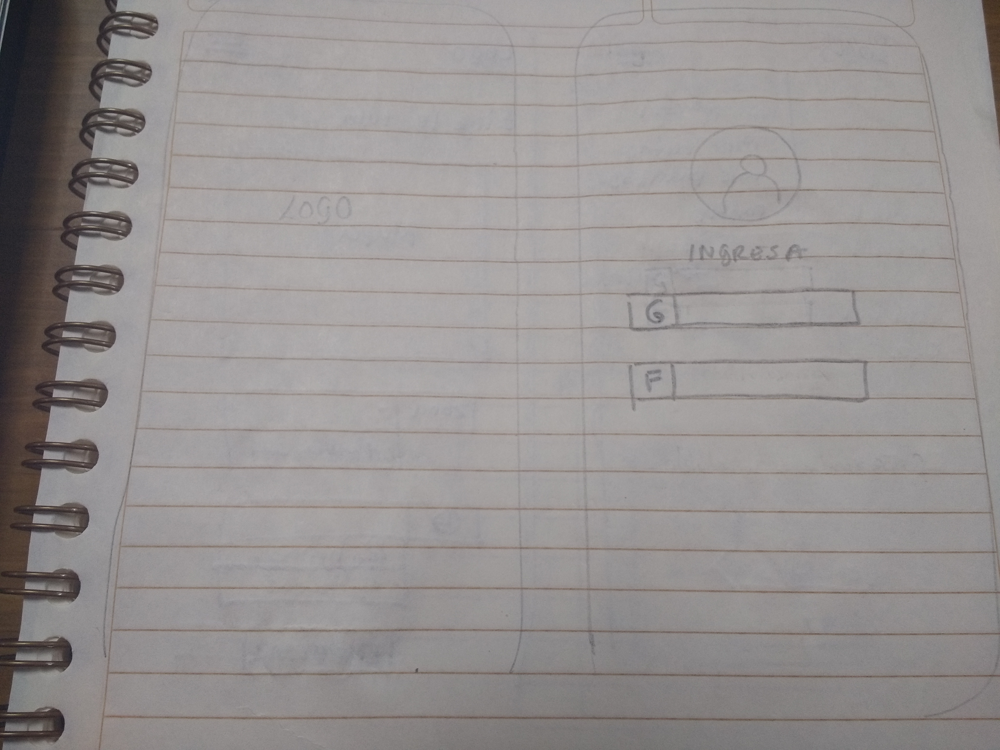
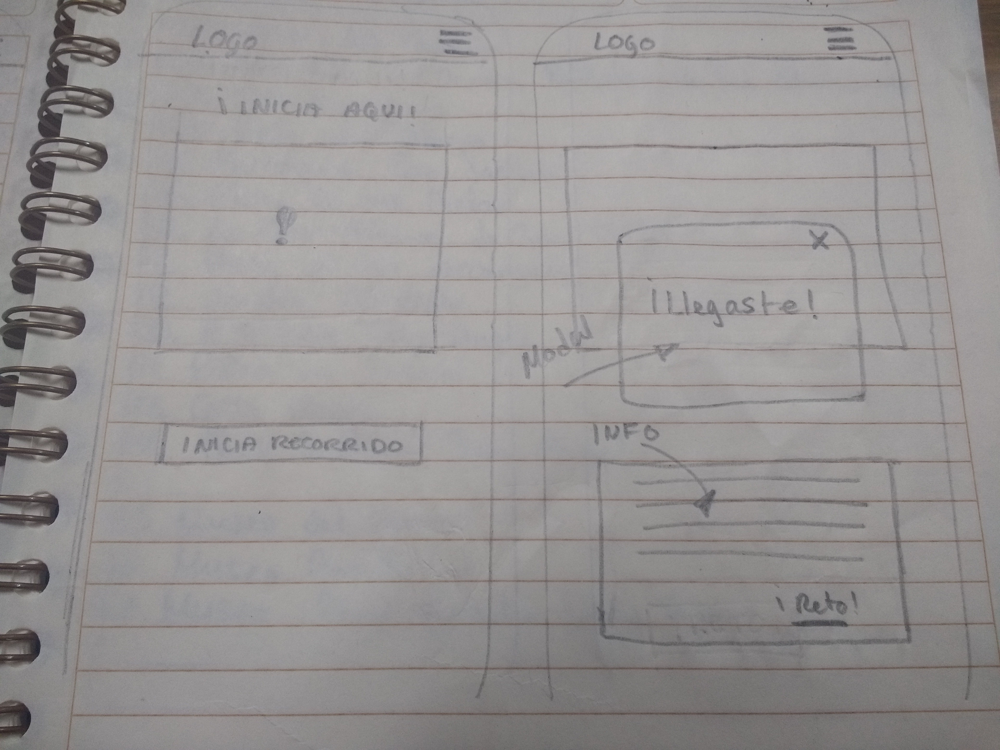

# Rally CDMX

## Squad
Equipo de trabajo conformado por:

* Carolina Barrios
* Tania Herrera
* Dení Morales
* Paulina Vargas

## Objetivo

Crear una web app que permite que el usuario recorra la ciudad de México  de manera divertida, conociendo puntos imperdibles de cada colonia por medio de rutas preestablecidas, con la modalidad de juego el cuál

## Requerimientos

* Plantear retos divertidos que le permitan insentivar su visita.
* Establecer rutas interesantes y fáciles de seguir.
* Acceder a la data necesaria para realizar la geolocalización.
* Ser mobile friendly

## Proceso de selección del producto

Iniciamos con  una lluvia de ideas y hubo un debate sobre la primera propuesta, que se trataba de  realizar una web misteriosa con archivos ocultos con esteganografía y acertijos. Sin embargo, no se pudo aterrizar el cómo sería la utilización de api´s.
Empezamos con seleccionar el rubro de cultura ya que testeamos entre nosotras nuestros gustos en cuanto a entretenimiento se trata y coincidimos en ello.
Buscamos api´s y app´s referentes a cultura se habló acera de un tour por zonas de la Cd de México con diversidad cultural e implementamos nuevamenta la primera propuesta de hacerlo a manera de juego realizando retos en cada parada que realice el usuario en la zona de una ruta pre-establecida.  

## Validando la idea

* A pesar que existen tours para los turistas que visitan la Cd de México, no existe alguno que sea mediante una app y aún mejor de la mano de un local.
* La modalidad de juego hará el recorrido mas divertido.
Ofrecer recompensas a través del conocimiento adquirido lo cuál mantiene la motivación durante el recorrido al llegar una meta.
* Canjear puntos por productos, servicios o experiencias de las empresas con lo que tenemos convenios. También puedes optar por cupones de descuentos.

##### Sitios similares
Corredor Roma-Condesa ccromacondesa.mx

## Agenda

**Dia 1:**
1. Lluvia de ideas para elegir el tema en el que se basará nuestro producto
2. Investigación de API
3. Elegir las ideas en las que se crea encontrar problematicas
4. Creación de un plan: Estimación de tiempo/tareas herramienta utilizada: Trello
5. Asignación de roles: UX Y frontend
6. Investigación de producto para UX
7. Determinar las problemátcas de funcionalidad, sólo frontend
8. Armar una solución al problema

**Dia 2:**

ÁREA UX
1. Darle un nombre a nuestra solución
2. Crear paleta de colores de nuestra web-app
3. Crear un logotipo
4. División de tareas por vistas en la app

ÁREA FRONTEND
1. Geolocalización
2. Waypoints
3. Coincidencias con la Data

**Dia 3:**
1. Funcionalidad completa de Google Maps API
2. Maquetación completa
3. Implemetación de retos por cada punto clave del recorrido

**Dia 4:**
1. Detalles de funcionalidad y maquetación
2. GitHub colaborativo

## Definición del diseño

Nombre: Rally CDMEX aún por confirmar
Isotipo: en contrucción
Paleta de colores: en construcción
Arquitectura de información (sketching)

